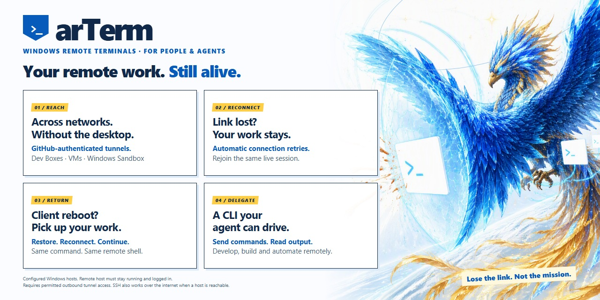

# arTerm

[](https://github.com/yeelam/arterm/releases/latest)

arTerm keeps a Windows remote shell running independently of
your local terminal. Return to the same shell with the same named command,
or control an attached session from another local CLI or agent.

## Why use it?

- **Long-running remote CLI agents and builds:** leave work running on a remote
  Windows machine, then reattach to its existing process and shell environment.
- **Network or VPN drops:** reconnect to the same session when connectivity
  returns, rather than start another shell.
- **Local tab loss or client reboot:** reopen your terminal and rerun the saved
  command from the same Windows user account with its local recovery data intact.
- **Automation alongside a human:** send a command, wait for its correlated
  completion, or read output without creating a second remote shell.

**Limit:** the remote host must stay running and logged in. Remote Windows
reboot/logoff, host crash/shutdown, or remote shell `exit` ends that process.
arTerm does not checkpoint or resurrect processes after those events.
Managed command execution requires a newly created, supported PowerShell/pwsh
session; existing sessions are not retrofitted.

## What you need

| Requirement | Local client | Remote host |
| --- | --- | --- |
| Operating system | Windows | Windows |
| arTerm component | `arTerm-Client-Setup.exe` | `arTerm-Host-Setup.exe` |
| Tunnel dependency | Microsoft **devtunnel CLI** | Compatible native **VS Code tunnel CLI**, such as `code-tunnel.exe` or standalone `code.exe` |
| Tunnel sign-in | Your GitHub account | **The same GitHub account** |

The full VS Code editor is optional when a compatible standalone native CLI is
provided. Tunnel sign-in is separate from `gh` CLI authentication.

Installers detect dependencies and offer downloads only with consent; vendor
binaries are not bundled. Host setup requires acceptance of the VS Code server
license terms. Host startup is at **Windows user logon**, not a SYSTEM service:
a cold boot requires Windows sign-in, and arTerm does not configure autologon.

## Get connected

1. Download the installers from [Releases](https://github.com/yeelam/arterm/releases/latest).
   Use an official signed build: local control requires valid Windows
   Authenticode chain trust and matching client binaries. Public CI artifacts
   and local builds are unsigned, not production IPC-ready. For self-signed
   development builds, follow
   [DEVELOPMENT-INSTALL.md](DEVELOPMENT-INSTALL.md) first. Their certificate is
   not publicly trusted; any local trust must be explicitly approved and
   permitted by your organization's policy.

2. **On the remote host**, run `arTerm-Host-Setup.exe`. Open a fresh PowerShell,
   then configure a unique host name:

   ```powershell
   arterm-host setup --name my-devbox
   ```

   Complete tunnel sign-in and keep the name-based client registration command
   printed by setup.

3. **On the local client**, run `arTerm-Client-Setup.exe`. Open a fresh PowerShell:

   ```powershell
   arterm setup
   ```

   Sign in with the same GitHub account. **Copy and run the host's printed
   registration command once**; client setup does not register the host for you.
   Then create your session:

   ```powershell
   arterm connect my-devbox MyWork
   ```

**Repeat that exact command to reattach.** `MyWork` is a non-secret session
reference, not a password. Press **Ctrl+]** to detach and leave the shell running;
type **`exit` inside the remote shell** to end it. Choose a new reference for a
new shell; ended or unavailable sessions are not silently replaced.

Without a reference, `arterm connect my-devbox` **only prints** a complete
reusable command and exits; it does not start a remote shell.

## Control an attached session

Leave `arterm connect my-devbox MyWork` running, then use another local terminal:

```powershell
arterm list --client
arterm list --server my-devbox
arterm send my-devbox MyWork --command 'Get-Location' --wait --timeout 60s
arterm read my-devbox MyWork --lines 20
```

`connect` is a normal running native process. Your caller, Copilot, or OS owns
backgrounding; arTerm has no `--background`, `start`, or `resume` command.
Each connection owns its own local named pipe, not a broadcast endpoint or
client daemon. Local controls require that exact active owner; missing or
ambiguous owners are errors. Authorized server inventory and termination also
work while detached.

`send` returns a command ID and acceptance, not proof of success. With `--wait`,
it returns early on the matching real completion **after output delivery**.
The explicit positive, finite timeout is required; exit 124 does not cancel
the remote command, nor does exiting the waiter. Query the command ID rather
than blindly resending. See [automation and limits](QUICKSTART.md#automation)
for status, interruption, termination, and idempotency.

For standalone dependency paths, setup options, and troubleshooting, see
[QUICKSTART.md](QUICKSTART.md). See [SIGNING.md](SIGNING.md) for signing policy.

## Session and recovery details

<details>
<summary>Names, retries, replay, and command history</summary>

References contain 1..64 ASCII letters, digits, `_`, or `-`, beginning with a
letter or digit. Names are case-insensitive (`MyWork` equals `mywork`); GUIDs
use canonical hyphenated form. References are scoped to the registered target
identity and current Windows user. They are not portable credentials.

The host owns a persistent ConPTY and drains output while detached. Retries
reuse the same internal GUID and creation request. Saved authorization uses
random credentials protected by Windows DPAPI, never secrets derived from names.
Repeat `arterm connect my-devbox MyWork` to recover it; saved legacy GUID
references remain supported by `connect`.

Mapping and protected state are persisted before remote creation. Exclusive
locks prevent concurrent local use from creating duplicate sessions. Missing,
corrupt, incomplete, expired, or unauthorized recovery records fail closed.
Do not delete them to troubleshoot a connection.

Repeating original `--shell` and `--cwd` values is supported when they exactly
match saved creation values. Incompatible overrides fail. `--retries` controls
attachment retries. Loopback `--address` and `--stdio` remain isolated-test
surfaces and are preserved in printed commands.

Session lifetime is separate from output retention. Replay is bounded: a
long-running process may outlive retained terminal history. A new console
replays the available output, not an exact screen checkpoint after eviction.
Input acknowledgments indicate acceptance into the host's ordered input path,
not completion of the shell command.

Type the complete reusable command so your shell records it normally. arTerm
does not append history, inject keystrokes, launch parent-shell wrappers, or
restore individual tabs. Legacy history environment variables do not enable
history injection.

</details>

## Installation and troubleshooting details

<details>
<summary>Dependency selection, discovery, and installer options</summary>

Installers are per-user and validate dependency Authenticode trust, Microsoft
publisher identity, and required CLI capabilities. Interactive installation
can offer the official WinGet packages `Microsoft.devtunnel` or
`Microsoft.VisualStudioCode` with explicit agreement consent. The latter
includes the editor; use a compatible standalone CLI and its setup path option
if you do not need it.

Installer `/quiet` or `/no-download` requires suitable preinstalled dependencies
and never starts a sign-in prompt. `/log <absolute-path>` records results.
`/uninstall` removes the product role, not vendor dependencies. Host updates and
uninstall refuse live sessions; finish them explicitly before upgrading.
Recovery data and the installer cache are retained.

Host setup uses isolated code CLI metadata rather than replacing an existing
managed tunnel. Use its printed registration command: it stores the friendly
host name, not a generated service ID. Connections and retries resolve that
name afresh through `devtunnel list`. Give hosts unique names under the account;
ambiguous names fail. Exact service IDs remain an advanced override, not the
default registration route.

`arterm doctor my-devbox` checks discovery and reachability. The host's
`code tunnel` and the client's `devtunnel connect` are two ends of the same
transport. If credentials have expired, run `arterm login` with the host's
GitHub account, then retry. Do not reinstall the host or delete session records.

</details>

## Upgrade and storage compatibility

<details>
<summary>Existing VsTerm installations, saved commands, and older hosts</summary>

arTerm 0.5 installs canonical `arterm.exe` / `arterm-host.exe` binaries and
byte-identical `vsterm.exe` / `vsterm-host.exe` compatibility aliases in the same
role directories. Existing absolute commands and registered host paths remain
valid without rewriting target configuration or recovery records.

The following remain stable compatibility identifiers, even on fresh installs:

- Data and protected state: `%LOCALAPPDATA%\VsTerm`.
- Installed binaries: `%LOCALAPPDATA%\Programs\VsTerm\Client` or `Host`.
- Existing registry keys, startup value, pipe identity, and session protocol.

New ownership markers use arTerm. Both legacy VsTerm publisher markers remain
accepted for upgrade/uninstall with the matching role. Installers check both
canonical and legacy runtime filenames and do not bypass live-session guards
when only an old executable name exists. Older DevBox Remote prototype state
is left untouched and is not automatically imported.

Reusable `connect` requires the host capability
`ended-session-rejection`, supplied by arTerm and compatible VsTerm 0.3 hosts.
Unsupported hosts are rejected before creation or attachment. The local
reservation remains available for retry with a compatible host; protocol
version 1 alone does not establish support.

For a still-live VsTerm 0.2 session, `connect` with its saved GUID
can use an existing unnamed record with a saved credential. This legacy path
warns that an old host may replay a retained exited session and return its old
exit code instead of rejecting it as already ended. It never creates a
replacement. A named record's GUID does not bypass capability negotiation.

Tokenless creation recovery on a 0.2 host still requires the matching 0.2 client.
Finish legacy sessions before upgrading their host; restarting the broker does
not preserve running shells. A failed `terminate` lookup of an unused GUID does
not reserve it or prevent its later first `connect`. Existing remote sessions
do not gain the new in-memory command adapter when a client reconnects.

</details>

## Build and test

<details>
<summary>Native Windows/MSVC builds and isolated verification</summary>

Windows x64 and the pinned MSVC Rust toolchain are required. The C runtime is
statically linked.

```text
cargo test --locked --features test-unsigned-ipc -- --test-threads=1
cargo run --locked --release --bin package
```

The package builder writes `arterm.exe`, `arterm-host.exe`,
`arTerm-Client-Setup.exe`, `arTerm-Host-Setup.exe`, `LICENSE`,
`THIRD-PARTY-NOTICES.txt`, and `SHA256SUMS`
to `dist`. Installers embed only the project's own executables. For runtime-only
builds:

```text
cargo build --locked --release --bin arterm --bin arterm-host
```

`test-unsigned-ipc` is an explicit debug-only fixture feature, off by default.
Release builds must omit it; enabling it for release fails compilation.
Production has no environment-variable or CLI authentication bypass.
Unsigned functional tests do not establish signed-production IPC readiness.
The separate signed CI gate exercises the actual signed CLI; see
[SIGNING.md](SIGNING.md) for its procedure, not a claim that a run has passed.

Tests exercise actual ConPTY processes, PID/state recovery, exit behavior,
history non-insertion, and console alignment. Installer lifecycle tests use
temporary files and redirected per-process HKCU; ignored checks require
installed signed vendor dependencies. The test-only `VSTERM_REMOTE_HOME`
selects isolated data. Never point tests at production state.
Tests do not sign into cloud accounts or change existing tunnels.

</details>

## License and signing

The source is [MIT licensed](LICENSE). Vendor components retain their own
licenses. VS Code Server/control RPC usage remains subject to Microsoft's
license and compatibility constraints; its Server binary is not redistributed.

Self-signed development downloads require the explicit trust procedure in
[DEVELOPMENT-INSTALL.md](DEVELOPMENT-INSTALL.md). SmartScreen reputation and
organizational application-control policy are separate from certificate trust.
Local package builds are unsigned by default. Neither a GitHub download nor
source availability establishes Authenticode trust.

<details>
<summary>Local IPC application identity and trust limits</summary>

The owner and caller mutually verify the actual OS-reported peer PID, image,
and token context. Both need valid Windows Authenticode chain trust, the exact
compiled public-certificate SHA-256, and byte-identical client images. Matching
user SID, logon, Windows session, integrity, and elevation are also required.
Filename or certificate subject alone, and arbitrary same-user programs, are
not trusted. Unsigned, tampered, wrong-certificate, or different-build peers
fail closed; a byte-identical `vsterm.exe` compatibility alias works.

This is an application-identity gate, not a hard boundary against administrators,
process injection, or other code invoking the legitimate CLI. arTerm does not
automatically import a certificate or change trust. Use the existing
[development trust guide](DEVELOPMENT-INSTALL.md) where policy permits it;
the certificate has not been recreated.

</details>

<details>
<summary>Maintainer signing and packaging sequence</summary>

A separate private, manual development-signing workflow signs runtime
executables before embedding them, then signs installers. Downloads include
the public certificate and instructions, never private signing material.
See [SIGNING.md](SIGNING.md) for policy and safeguards.

For an approved signing pipeline, build/sign the runtime first, then package
those exact bytes without rebuilding:

```text
target\release\package.exe --payload-dir <directory-containing-signed-runtime-exes>
```

Sign the resulting installers and regenerate checksums afterward. The default
package command is not a signing flow. Never commit signing keys or bypass
organizational software policy.

</details>
