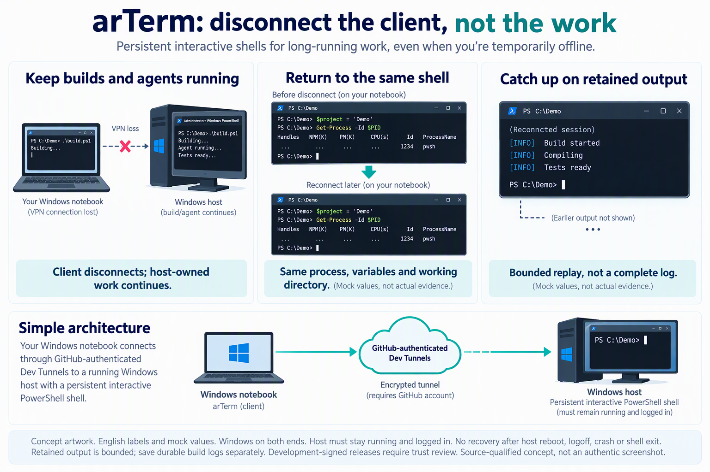

# arTerm: terminale remoto Windows persistente dopo una disconnessione

<a id="languages"></a>
<details>
<summary>Languages / 语言 / 言語 / اللغات (16)</summary>

[English](../../README.md) | [简体中文](README.zh-CN.md) | [繁體中文](README.zh-TW.md) | [日本語](README.ja.md) | [한국어](README.ko.md) | [Español](README.es.md) | [Português (Brasil)](README.pt-BR.md) | [Français](README.fr.md) | [Deutsch](README.de.md) | [Italiano](README.it.md) | [Русский](README.ru.md) | [Türkçe](README.tr.md) | [Tiếng Việt](README.vi.md) | [Bahasa Indonesia](README.id.md) | [हिन्दी](README.hi.md) | [العربية](README.ar.md)

</details>

Mantieni build e agenti di programmazione attivi se perdi il client o la VPN; torna alla stessa shell interattiva, variabili e directory; consulta l’output conservato: riproduzione limitata, non un log completo. Windows a entrambe le estremità; host acceso e utente connesso. Nessun recupero dopo riavvio o disconnessione dell’utente Windows sull’host.

[Configura](../../README.md#get-connected) · [Verifica download e fiducia](../../DEVELOPMENT-INSTALL.md) · [Verifica la stessa shell](../../README.md#prove-that-you-returned-to-the-same-shell)



*Illustrazione del flusso, non schermata di una sessione reale né prova di test. Le etichette nell’immagine sono in inglese. Il punto è tornare alla stessa shell, variabili e lavoro dopo la disconnessione del client, mentre l’host resta acceso e l’utente connesso. Non conserva i processi dopo un riavvio dell’host.*

- **Il lavoro continua senza il client.** Build, agenti e comandi lunghi restano attivi sull’host Windows remoto alla chiusura del client, perdita della VPN o riavvio del portatile.
- **Torna al lavoro, non a una shell vuota.** Ricollegati allo stesso processo di shell interattiva, con le sue variabili e directory di lavoro.
- **Consulta quanto accaduto durante l’assenza.** La riconnessione riproduce l’output conservato del terminale; la conservazione è limitata, sono possibili lacune e non è un log completo.

Per normali attività non interattive può bastare il canale di comandi remoti già approvato. Scegli arTerm quando vuoi ricollegarti alla **stessa shell Windows interattiva e al suo ambiente, eseguiti sull’host**, dopo la chiusura del client, la perdita della VPN o il riavvio del portatile, rispettando i requisiti di connessione e i controlli locali documentati. Entrambe le macchine devono usare Windows e l’host deve restare acceso con l’utente connesso; non è un recupero dopo il riavvio dell’host.


Perdi la connessione, non il lavoro. Lascia build, comandi di lunga durata e agenti di programmazione sul computer Windows remoto. Dopo la chiusura del client, la perdita della VPN o il riavvio del portatile, torna alla stessa shell, con le stesse variabili e cartella di lavoro.

L’host remoto mantiene la shell in esecuzione; il portatile si limita a collegarsi ad essa.

Adatto con Windows su entrambi i lati, stesso account GitHub per i tunnel e connessioni in uscita consentite. L’host deve restare acceso con l’utente connesso. Riavvio, logout, crash o spegnimento dell’host e exit della shell non consentono di ripristinare il processo. I download attuali sono firmati per sviluppo, non build di produzione riconosciute pubblicamente.

[Verifica il download e valuta la fiducia prima di installare](../../DEVELOPMENT-INSTALL.md). Non aggirare avvisi del sistema o policy dell’organizzazione.

[Scarica x64 / ARM64](https://github.com/yeelam/arterm/releases/latest) · [Configura](../../README.md#get-connected) → [Verifica il ritorno alla stessa shell](../../README.md#prove-that-you-returned-to-the-same-shell)

## Requisiti e fiducia

Client e host richiedono Windows. L’host deve restare acceso con l’utente connesso. Il client usa Microsoft devtunnel CLI; l’host una CLI nativa compatibile con i tunnel VS Code, come code-tunnel.exe. L’editor completo è facoltativo. Accedi ai due tunnel con lo stesso account GitHub: l’autenticazione di gh è separata. Servono connessioni in uscita consentite, consenso ai download delle dipendenze e accettazione della licenza VS Code server.

Scegli x64 o ARM64 nei [download Windows](https://github.com/yeelam/arterm/releases/latest). La versione pubblicata v0.7.1 ha una firma di sviluppo, non un certificato di produzione riconosciuto pubblicamente. Prima confronta il ZIP con il manifesto pubblico della stessa versione usando Get-FileHash, come nella [verifica del pacchetto](../../DEVELOPMENT-INSTALL.md#verify-the-downloaded-release-payload-before-trust-or-installation). Hash ZIP, identità CER e fiducia della firma eseguibile sono distinti. Prima di eseguire, usa Get-AuthenticodeSignature seguendo il [controllo in sola lettura](../../DEVELOPMENT-INSTALL.md#inspect-extracted-executable-signatures-without-running-them) di installer e client estratti: firmatario di sviluppo fissato e stato Valid. Checksum assente o diverso, firmatario sconosciuto o stato non Valid impongono di fermarsi. La fiducia richiede separatamente approvazione esplicita dell’utente e permesso della policy, poi una nuova verifica. Non aggirare avvisi OS, Authenticode, SmartScreen o controlli applicativi.


L’host richiede anche Windows Script Host/VBScript consentito dalla policy. Verifica prima di fiducia/installazione; se bloccato, fermati senza aggirare la policy.

## Configurazione

Output conservato, normale cronologia della shell e file di recupero possono contenere comandi, percorsi, codice o segreti. Proteggili su entrambe le macchine e oscura i dati sensibili prima di condividere log, immagini o materiali di supporto. DPAPI protegge le credenziali, non significa che ogni file sia cifrato o privo di contenuto. Le esclusioni dei diagnostici di disponibilità sono più limitate.

Dopo le verifiche e con il permesso della policy, esegui arTerm-Host-Setup.exe sull’host remoto e apri un nuovo PowerShell:

```powershell
arterm-host setup --name my-devbox
```

Completa l’accesso al tunnel e conserva il comando di registrazione stampato dall’host. Installa arTerm-Client-Setup.exe localmente, apri un nuovo PowerShell e usa lo stesso account GitHub. Esegui esattamente il comando di registrazione con il percorso reale stampato. Il client è già inizializzato; arterm setup non serve. Con un nuovo nome di sessione, connettiti localmente:

```powershell
arterm connect my-devbox MyProof --shell powershell
```

## Verificare la stessa shell

Nella PowerShell remota connessa, esegui e annota PID e cartella:

```powershell
$artermProof = 'kept-on-host'
$artermPid = $PID
$artermCwd = (Get-Location).Path
$PID; $artermProof; (Get-Location).Path
```

Premi Ctrl+] per scollegare solo il client. Se il terminale intercetta la scorciatoia, chiudi soltanto la scheda del client locale. Lascia l’host acceso e l’utente connesso; ripeti lo stesso comando localmente:

```powershell
arterm connect my-devbox MyProof --shell powershell
```

Nella PowerShell remota ritrovata:

```powershell
$PID; $artermProof; (Get-Location).Path
($PID -eq $artermPid) -and ($artermProof -eq 'kept-on-host') -and ((Get-Location).Path -eq $artermCwd)
```

Il risultato atteso è lo stesso PID, kept-on-host, la stessa cartella e True. Riutilizza il comando per continuare il lavoro. Per terminare la prova, scrivi exit nella shell remota: termina il processo e il suo stato non è recuperabile.

## Limiti

Non vengono ripristinati processi dopo riavvio, logout, crash o spegnimento dell’host, né dopo l’uscita dalla shell. L’host parte al login dell’utente; non configura login automatico o servizi senza utente connesso. La riproduzione dell’output è limitata. L’intero branch di sviluppo non è qualificato per il rilascio: restano aperti la revisione indipendente degli archivi di trasferimento e i criteri di input diretto. Le TUI arbitrarie non sono certificate; lo sblocco automatico dei file non ne garantisce la sicurezza.


La riproduzione è limitata; conserva un log di compilazione remoto per tutto l’output. arterm-host stop può riavviarsi automaticamente; arterm-host stop --disable mantiene l’arresto.

## Recupero e annullamento

Se fallisce, usa arterm doctor my-devbox per account e rete e, se necessario, arterm --login per recuperare l’accesso del client. Non cancellare dati di recupero né reinstallare un host attivo. Gli aggiornamenti rifiutano per impostazione predefinita di interrompere sessioni attive. Sull’host arterm-host stop --disable mantiene l’arresto; arterm-host start lo riavvia ma non recupera shell perse. La disinstallazione conserva i dati; la guida spiega come revocare la fiducia del certificato.

## Controllo locale avanzato

send/read gestiti richiedono una nuova sessione PowerShell/pwsh supportata e l’identità locale affidabile corrispondente alla connessione. Le shell esistenti non sono adattate. La pubblicazione non chiude i criteri di input diretto/revisione degli archivi trasferiti del branch; versioni sconosciute restano non verificate.


Chi usa Copilot CLI, Claude Code, Codex, Gemini CLI, Kimi o Qwen CLI può seguire i comandi Windows ordinari se gli strumenti lo consentono, senza certificazione di integrazione nativa dei sei client. Un altro terminale di controllo locale richiede stesso utente, sessione, integrità/elevazione e client firmato affidabile identico byte per byte. Mantieni attivo il processo di connessione. Non è condivisione arbitraria fra agenti su macchine diverse.

[English README](../../README.md) · [Quick start](../../QUICKSTART.md) · [Automation](../../QUICKSTART.md#automation) · [Risoluzione dei problemi](../../README.md#installation-and-troubleshooting-details) · [Aggiornamento e arresto](../../QUICKSTART.md#upgrade-without-registering-again) · [Revocare la fiducia nel certificato](../../DEVELOPMENT-INSTALL.md) · [Release evidence / gates](../../README.md#released-downloads-versus-development-gates) · [Signing](../../SIGNING.md)
